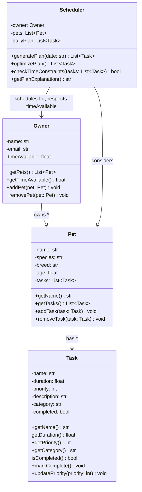

# PawPal+ UML Class Diagram

## Class Relationships

- **Owner → Pet** (owns *): One owner can have multiple pets
- **Pet → Task** (has *): Each pet can have multiple care tasks
- **Scheduler → Owner** (schedules for, respects timeAvailable): The scheduler coordinates with the owner and respects their time constraints
- **Scheduler → Pet** (considers): The scheduler considers all pets when generating plans
